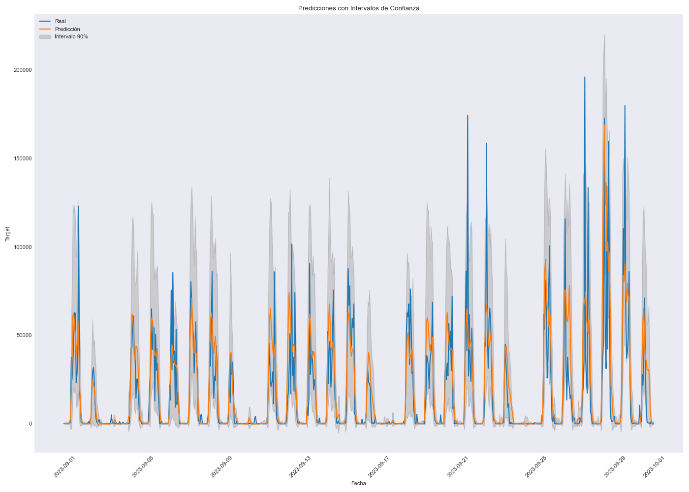

# 📊 Análisis de Series de Tiempo para Dimensionamiento de Liquidez en una Casa de Cambio Digital

## 📝 Descripción del Proyecto

Este proyecto tiene como objetivo desarrollar un modelo de series de tiempo para predecir la demanda de divisas en una casa de cambio digital. La predicción precisa de la cantidad de divisas necesarias en las cuentas permite optimizar la liquidez, minimizando costos por falta de fondos y evitando sobrecostes innecesarios.

🔹 **Este proyecto tiene un carácter especial**, ya que fue mi primera experiencia aplicando lo aprendido en el `bootcamp de Data Science` a un caso real con datos reales de una empresa. Aunque aquí presento solo una pequeña parte del análisis, éste fue mi primer desafío oficial como `Data Scientist` adquieriendo muchos aprendizajes a nivel personal y profesional 🚀

## 🔍 Enfoque Metodológico

1. **🛠️ Preprocesamiento de Datos:** 
   - 📂 Recolección y limpieza de datos históricos de transacciones de compra de divisas.
   - 🔄 Transformaciones necesarias para garantizar la estacionalidad y estacionariedad de la serie de tiempo.

2. **📈 Modelado con XGBoost y Skforecast:** 
   - 🤖 Adaptación de la serie de tiempo a un problema de regresión para utilizar `XGBoostRegressor` en `Skforecast`.
   - ⚙️ Ingeniería de características para mejorar la capacidad predictiva del modelo.

3. **🎯 Optimización de Parámetros:** 
   - 🚀 Uso de optimización bayesiana para encontrar la mejor configuración de hiperparámetros del modelo.

4. **📊 Evaluación con Backtesting:** 
   - 🧪 Validación del modelo con backtesting para medir su desempeño en datos históricos no vistos.

5. **📉 Análisis de Intervalos de Confianza:** 
   - 📏 Evaluación de la cobertura de los intervalos de confianza para garantizar que las predicciones capturan adecuadamente la incertidumbre del sistema.

## ⚙️ Requisitos del Proyecto

Para ejecutar este proyecto, se requiere instalar las siguientes dependencias utilizando Poetry:

```bash
poetry install
```

## 📂 Estructura del Proyecto
```
|-- raw/                            # Datos crudos
|   |-- Base_operaciones.csv
|   |-- Mesas de dinero y casas.csv
|-- processed/                      # Datos procesados
|   |-- Base_operaciones.csv
|   |-- Mesas de dinero y casas.csv
|-- Notebook/                       # Almacenamiento de notebooks
|   |-- model.ipynb                 # Notebook de consolidación
|-- utils/                          # Clases usadas
|   |-- eda.py                      # Clase que realiza un EDA orientado a series de tiempo
|   |-- preprocessing.py            # Limpieza y preprocesamiento de datos
|-- README.md                       # Documentación del proyecto
|-- pyproject.toml                  # Configuración de dependencias con Poetry
```

## 📢 Resultados y Conclusiones

El modelo desarrollado permite predecir de manera efectiva la cantidad de divisas necesarias, optimizando la liquidez y reduciendo costos.

## 📊 Visualización de resultados
[Gráficos de predicciones](img/predicciones_intervalos.png)

## 📈 Visualización de errores



**Obteniendo un MAE igual 8340.746442 y un coverage del 92.36%**

El análisis de intervalos de confianza garantiza que las predicciones reflejen la incertidumbre inherente a las operaciones financieras de la casa de cambio.

## 📩 Contact
Cualquier pregunta o feedback es bien recibido. Me puedes contactar por [Linkeind](www.linkedin.com/in/ronaldespinoza).

